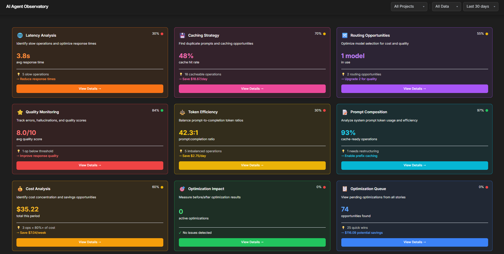

# AI Agent Observatory

**Production-ready observability platform for AI agents and LLM applications**

Track every LLM call, understand your costs, and optimize performance with actionable insights.


<p align="center">
  <a href="docs/media/Observatory.mp4">
    
  </a>
  <br>
  <em>Click to watch the demo video</em>
</p>

---

## The Problem

Building AI agents is easy. **Understanding why they cost so much is hard.**

Most teams discover their LLM costs are 10x higher than expected, but have no visibility into *why*:
- Which prompts are bloated?
- Which calls could be cached?
- Which operations use GPT-4 when GPT-4o-mini would suffice?

## The Solution

**Observatory answers these questions** by passively tracking every LLM call and surfacing actionable insights:

| Insight | Example |
|---------|---------|
| Token waste | "Your system prompts consume 80% of tokens" |
| Cache opportunities | "38% of calls are exact duplicates - enable caching to save $2.30/day" |
| Model routing | "Simple operations use expensive models - route to gpt-4o-mini for 70% savings" |

> Observatory is a **passive observer** - it tracks and visualizes, but never modifies your LLM calls unless you explicitly enable optimizations.

---

## Key Features

| Feature | Description |
|---------|-------------|
| **139 Metrics per Call** | Tokens, cost, latency, quality, cache, routing - comprehensive tracking |
| **7 Analytics Stories** | Cost, Latency, Tokens, Quality, Prompts, Cache, Routing |
| **3-Layer Drill-Down** | KPIs → Operations → Individual Calls |
| **Simple Integration** | One decorator: `@observe` |
| **Two-Phase Workflow** | Baseline (detect) → Optimized (apply fixes) |
| **Framework Agnostic** | Works with LangChain, AutoGen, Semantic Kernel, or raw OpenAI/Anthropic |
| **Full Stack** | Python SDK + FastAPI Backend + React Dashboard |

---

## Quick Start

### 1. Install

```bash
git clone https://github.com/bryan-lolordo/ai-agent-observatory.git
cd ai-agent-observatory
pip install -e .
```

### 2. Add Tracking (One Line)

```python
from observatory_config import observe

@observe(operation="chat", agent_name="ChatBot")
async def chat(prompt: str):
    return await client.chat.completions.create(
        model="gpt-4o-mini",
        messages=[{"role": "user", "content": prompt}]
    )

# That's it. All metrics tracked automatically.
```

### 3. Run the Dashboard

```bash
# Terminal 1: API
uvicorn api.main:app --port 8000

# Terminal 2: Frontend
cd frontend && npm install && npm run dev
```

Open `http://localhost:5173` to view your metrics.

---

## How It Works

### Phase 1: Baseline (Detect)

Run your application normally. Observatory passively tracks every LLM call and detects optimization opportunities:

```python
# .env
OBSERVATORY_PHASE=baseline
```

The dashboard shows:
- Cost breakdown by model, agent, operation
- Cache opportunities (exact matches, semantic similarity)
- Routing suggestions (model upgrade/downgrade)
- Token efficiency analysis

### Phase 2: Optimized (Apply)

After reviewing the dashboard, add optimizations to your config:

```python
# observatory_config.py
OPTIMIZATIONS = {
    "chat": {"cache": {"enabled": True, "ttl": 1800}},
    "score_resume": {"route_to": "gpt-4o-mini"},
}
```

Switch to optimized mode:

```python
# .env
OBSERVATORY_PHASE=optimized
```

Compare baseline vs. optimized metrics to measure impact.

---

## Architecture

```
ai-agent-observatory/
├── observatory/              # Python SDK
│   ├── observe.py            # @observe decorator - main interface
│   ├── collector.py          # Core Observatory class
│   ├── cache.py              # CacheManager + PrefixCacheDetector
│   ├── semantic_cache.py     # Vector similarity caching
│   ├── judge.py              # LLM-as-judge quality evaluation
│   ├── router.py             # Intelligent model routing
│   ├── execution.py          # Batch/parallel/streaming detectors
│   ├── resilience.py         # Circuit breaker for production
│   ├── async_writer.py       # Non-blocking database writes
│   └── health.py             # Component health monitoring
│
├── api/                      # FastAPI backend
│   ├── routers/stories/      # 7 analytics story endpoints
│   └── services/             # Business logic layer
│
├── frontend/                 # React + Vite + Tailwind
│   └── src/pages/            # Dashboard, Stories, Optimization Queue
│
└── templates/                # Integration templates
    ├── observatory_config_template.py
    └── INTEGRATION_GUIDE.md
```

---

## 7 Analytics Stories

Each story provides KPIs, operation-level breakdown, and individual call inspection:

| Story | What It Shows |
|-------|---------------|
| **Cost** | Spending by model, agent, operation with cost breakdowns |
| **Latency** | Bottlenecks, slow calls, P50/P95/P99 performance |
| **Tokens** | Usage analysis, input/output ratios, waste detection |
| **Quality** | LLM-as-judge scores, hallucination detection, error tracking |
| **Prompts** | System prompt analysis, chat history breakdown, token distribution |
| **Cache** | Cacheable patterns (exact, prefix, semantic) with ROI estimates |
| **Routing** | Model upgrade/downgrade recommendations with savings projections |

---

## Production Features

Observatory v0.4.0 includes enterprise-ready features:

| Feature | Description |
|---------|-------------|
| **@observe Decorator** | Single decorator replaces 400+ lines of manual tracking code |
| **CircuitBreaker** | Fail-fast protection with configurable thresholds |
| **AsyncWriteQueue** | Non-blocking database writes for minimal latency impact |
| **SafeWrapper** | Graceful degradation - tracking failures never break your app |
| **HealthChecks** | `/health` endpoint for all SDK components |
| **Two-Phase Optimization** | Baseline detection → Optimized execution with A/B comparison |

---

## Tracked Metrics

139 fields per LLM call across 12 categories:

| Category | Example Fields |
|----------|----------------|
| **Core** | timestamp, provider, model, success/error |
| **Tokens** | prompt, completion, system, history, tools, cached |
| **Cost** | prompt_cost, completion_cost, total, savings |
| **Latency** | total_ms, time_to_first_token, tool_execution |
| **Context** | agent_name, operation, conversation_id, user_id |
| **Cache** | hit/miss, key, similarity_score, savings |
| **Routing** | chosen_model, alternatives, complexity_score |
| **Quality** | judge_score, hallucination_flag, confidence |
| **Errors** | error_type, error_code, retry_count |

See [docs/METRICS.md](docs/METRICS.md) for the complete reference.

---

## Integration Example

### Before Observatory (Manual Tracking)

```python
async def chat(message: str):
    start = time.time()
    try:
        response = await client.chat.completions.create(...)
        latency = (time.time() - start) * 1000

        # 50+ lines of manual tracking...
        track_llm_call(
            model_name="gpt-4o-mini",
            prompt_tokens=response.usage.prompt_tokens,
            completion_tokens=response.usage.completion_tokens,
            latency_ms=latency,
            # ... 40 more parameters
        )
        return response
    except Exception as e:
        # Error tracking...
        raise
```

### After Observatory

```python
from observatory_config import observe

@observe(operation="chat", agent_name="ChatBot")
async def chat(message: str):
    return await client.chat.completions.create(
        model="gpt-4o-mini",
        messages=[{"role": "user", "content": message}]
    )
```

The `@observe` decorator automatically:
- Times execution
- Extracts tokens, cost, content from any LLM response format
- Runs all detectors (cache, routing, streaming, batch, context growth)
- Tracks conversation context if provided
- Handles errors with classification
- Records to database with 139 fields

---

## Tech Stack

| Layer | Technologies |
|-------|-------------|
| **SDK** | Python 3.10+, Pydantic v2, SQLAlchemy |
| **Backend** | FastAPI, SQLite (dev) / PostgreSQL (prod) |
| **Frontend** | React 18, Vite, Tailwind CSS, Recharts |

---

## Documentation

| Document | Description |
|----------|-------------|
| [Integration Guide](templates/INTEGRATION_GUIDE.md) | Step-by-step setup for your project |
| [API Reference](docs/API.md) | Backend endpoints |
| [Metrics Reference](docs/METRICS.md) | All 139 tracked fields |
| [SDK Design](docs/UNIVERSAL_SDK_PLAN.md) | Architecture and design decisions |

---

## License

MIT License - free for personal and commercial use.

---

## Author

**Bryan LoLordo**
[GitHub](https://github.com/bryan-lolordo) | [LinkedIn](https://linkedin.com/in/bryanlolordo)
