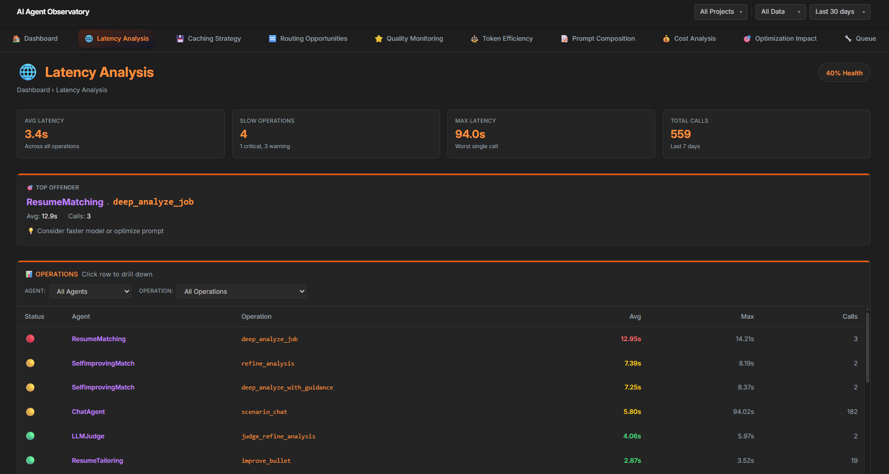
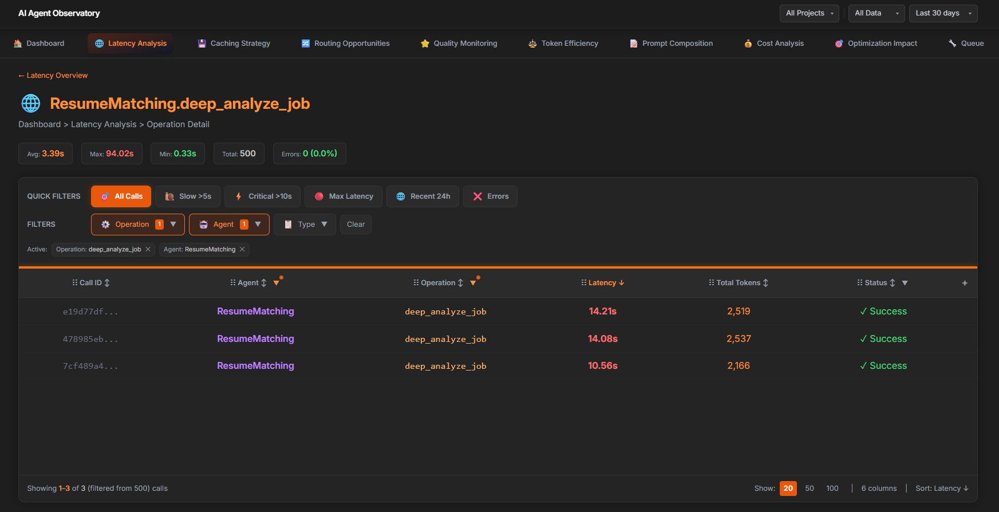
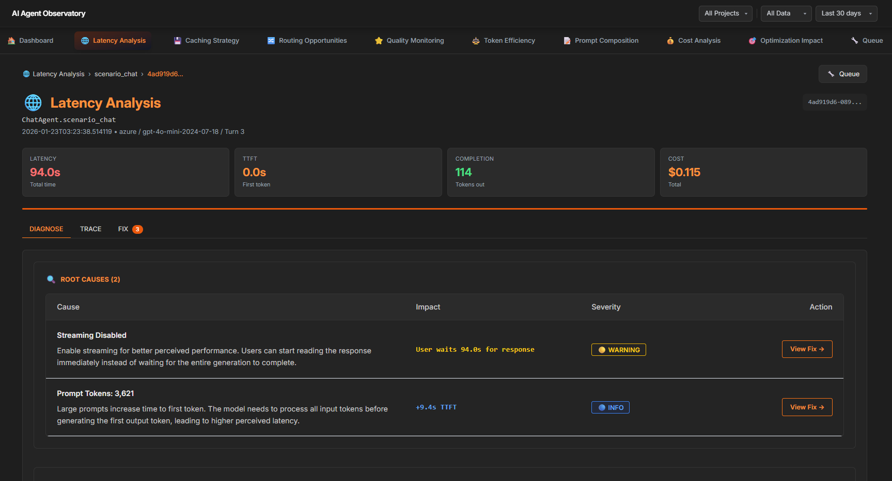
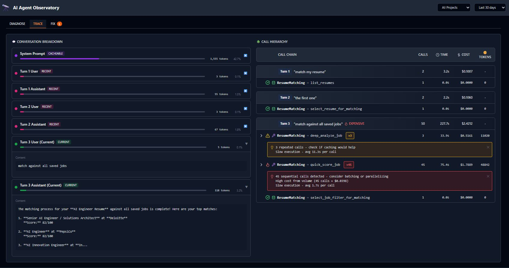
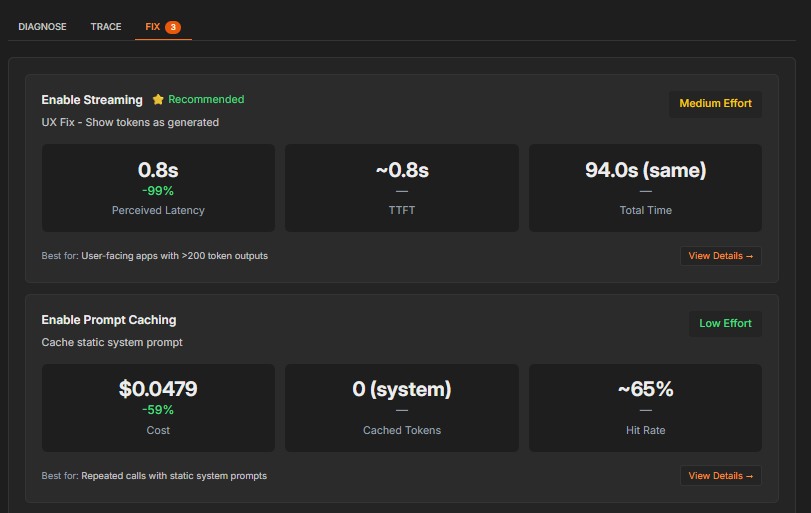
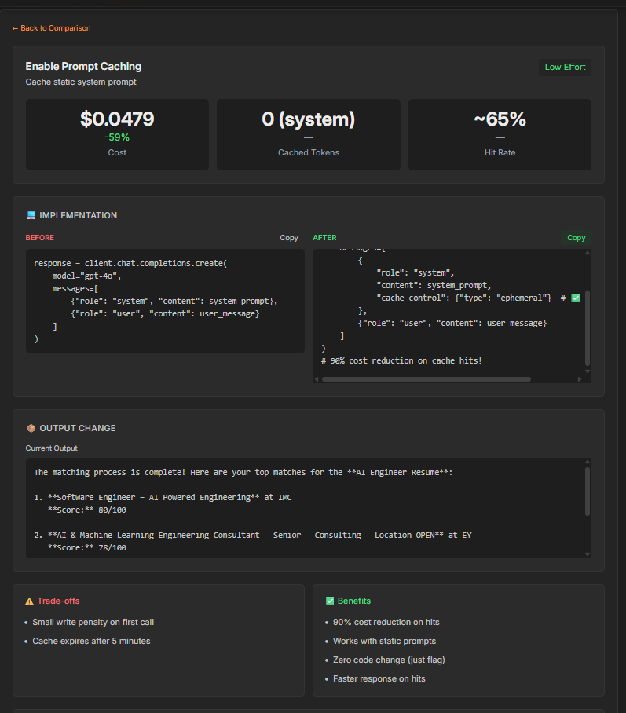
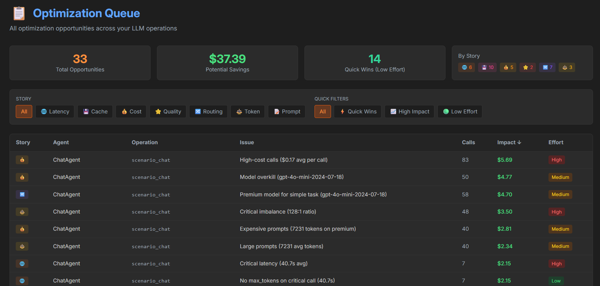
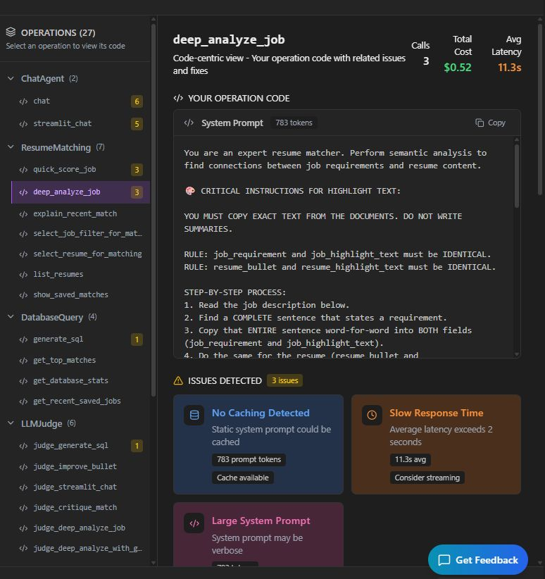
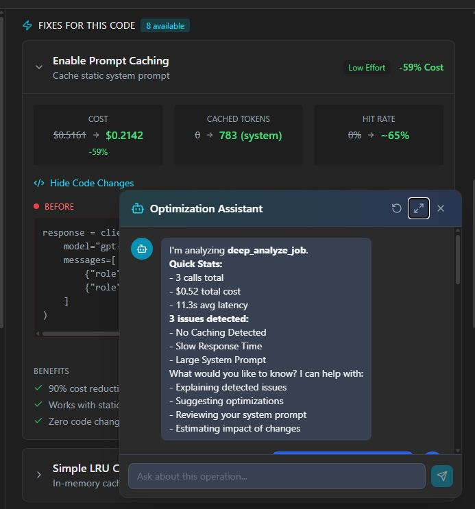
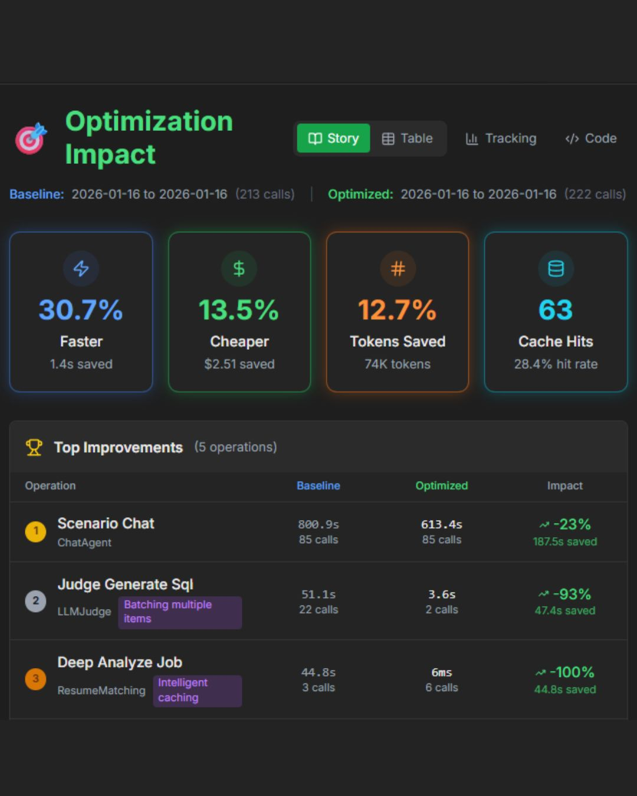

# AI Agent Observatory

**Production-ready observability platform for AI agents and LLM applications**

Track every LLM call, understand your costs, and optimize performance with actionable insights.


<p align="center">
  <a href="https://www.youtube.com/watch?v=IN04Y7UoLGk">
    
  </a>
  <br>
  <em>Click to watch the demo video</em>
</p>

---

## The Problem

Building AI agents is easy. **Understanding why they cost so much is hard.**

Most teams discover their LLM costs are 10x higher than expected, but have no visibility into *why*:
- Which prompts are bloated?
- Which calls could be cached?
- Which operations use GPT-4 when GPT-4o-mini would suffice?

## The Solution

**Observatory answers these questions** by passively tracking every LLM call and surfacing actionable insights:

| Insight | Example |
|---------|---------|
| Token waste | "Your system prompts consume 80% of tokens" |
| Cache opportunities | "38% of calls are exact duplicates - enable caching to save $2.30/day" |
| Model routing | "Simple operations use expensive models - route to gpt-4o-mini for 70% savings" |

> Observatory is a **passive observer** - it tracks and visualizes, but never modifies your LLM calls unless you explicitly enable optimizations.

---

## Visual Walkthrough

### 1. Dashboard - Select an Agent Operation

Start at the dashboard to see overall performance across all your AI applications. Click on any operation to drill in.


---

### 2. Layer 1 - Issues by Category

See issues grouped by **latency**, **caching**, **cost**, and **token usage**. Each category shows optimization opportunities with estimated savings.



---

### 3. Layer 2 - Drill Into a Category

Click into any category to see which specific operations are causing problems and their impact.



---

### 4. Layer 3 - Exact Code Causing the Problem

Drill down to the individual call level to see the exact code and parameters causing inefficiencies.



---

### 5. Trace Tab - Full Request Timeline

View the complete trace of an LLM call, including timing breakdown and all context passed to the model.



---

### 6. Fix Tab - Apply Fixes with Impact Estimates

Get actionable fixes with real code changes. Each fix shows **effort** and **impact** estimates so you can prioritize.





---

### 7. Optimization Queue - Prioritize Improvements

View all optimization opportunities across your stories in one place. Sort by impact, effort, or category to decide what to tackle first.



---

### 8. Code View with AI Assistant

See the exact code that needs changing. The built-in AI chatbot explains **why** each fix works for your specific operation.





---

### 9. Optimization Impact - Before & After

After applying fixes, see the real impact on your AI system. Compare baseline vs optimized metrics to measure improvements.



---

## Key Features

| Feature | Description |
|---------|-------------|
| **139 Metrics per Call** | Tokens, cost, latency, quality, cache, routing - comprehensive tracking |
| **7 Analytics Stories** | Cost, Latency, Tokens, Quality, Prompts, Cache, Routing |
| **3-Layer Drill-Down** | KPIs → Operations → Individual Calls |
| **Simple Integration** | One decorator: `@observe` |
| **Two-Phase Workflow** | Baseline (detect) → Optimized (apply fixes) |
| **V2 Evaluation System** | YAML test suites, pluggable evaluators, version comparison |
| **MCP Server** | Query metrics from AI assistants (Claude, GPT) via Model Context Protocol |
| **Framework Agnostic** | Works with LangChain, AutoGen, Semantic Kernel, or raw OpenAI/Anthropic |
| **Full Stack** | Python SDK + FastAPI Backend + React Dashboard |

---

## Quick Start

### 1. Install

```bash
git clone https://github.com/bryan-lolordo/ai-agent-observatory.git
cd ai-agent-observatory
pip install -e .
```

### 2. Add Tracking (One Line)

```python
from observatory_config import observe

@observe(operation="chat", agent_name="ChatBot")
async def chat(prompt: str):
    return await client.chat.completions.create(
        model="gpt-4o-mini",
        messages=[{"role": "user", "content": prompt}]
    )

# That's it. All metrics tracked automatically.
```

### 3. Run the Dashboard

```bash
# Terminal 1: API
uvicorn api.main:app --port 8000

# Terminal 2: Frontend
cd frontend && npm install && npm run dev
```

Open `http://localhost:5173` to view your metrics.

---

## How It Works

### Phase 1: Baseline (Detect)

Run your application normally. Observatory passively tracks every LLM call and detects optimization opportunities:

```python
# .env
OBSERVATORY_PHASE=baseline
```

The dashboard shows:
- Cost breakdown by model, agent, operation
- Cache opportunities (exact matches, semantic similarity)
- Routing suggestions (model upgrade/downgrade)
- Token efficiency analysis

### Phase 2: Optimized (Apply)

After reviewing the dashboard, add optimizations to your config:

```python
# observatory_config.py
OPTIMIZATIONS = {
    "chat": {"cache": {"enabled": True, "ttl": 1800}},
    "score_resume": {"route_to": "gpt-4o-mini"},
}
```

Switch to optimized mode:

```python
# .env
OBSERVATORY_PHASE=optimized
```

Compare baseline vs. optimized metrics to measure impact.

---

## Architecture

```
ai-agent-observatory/
├── observatory/              # Python SDK
│   ├── observe.py            # @observe decorator - main interface
│   ├── collector.py          # Core Observatory class
│   ├── cache.py              # CacheManager + PrefixCacheDetector
│   ├── semantic_cache.py     # Vector similarity caching
│   ├── judge.py              # LLM-as-judge quality evaluation
│   ├── router.py             # Intelligent model routing
│   ├── execution.py          # Batch/parallel/streaming detectors
│   ├── resilience.py         # Circuit breaker for production
│   ├── async_writer.py       # Non-blocking database writes
│   ├── health.py             # Component health monitoring
│   │
│   ├── evaluation/           # V2 Evaluation System (NEW)
│   │   ├── pipeline.py       # EvaluationPipeline orchestrator
│   │   ├── runner.py         # TestRunner for executing test suites
│   │   ├── test_suite.py     # YAML/JSON test suite loader
│   │   ├── reporter.py       # Console/Markdown/JSON reporters
│   │   └── eval_storage.py   # Evaluation results persistence
│   │
│   ├── evaluators/           # Pluggable evaluators
│   │   ├── tool_use.py       # FREE: AST-based tool call validation
│   │   └── model_judge.py    # Haiku-based semantic evaluation
│   │
│   └── mcp/                  # MCP Server (NEW)
│       ├── server.py         # Model Context Protocol server
│       ├── tools/            # 7 tool categories
│       ├── resources/        # Live metrics resources
│       └── prompts/          # Analysis prompt templates
│
├── api/                      # FastAPI backend
│   ├── routers/stories/      # 7 analytics story endpoints
│   └── services/             # Business logic layer
│
├── frontend/                 # React + Vite + Tailwind
│   └── src/pages/            # Dashboard, Stories, Optimization Queue
│
└── templates/                # Integration templates
    ├── observatory_config_template.py
    ├── eval_suite_template.yaml      # Test suite template
    ├── run_evals_template.py         # Evaluation runner template
    └── INTEGRATION_GUIDE.md
```

---

## 7 Analytics Stories

Each story provides KPIs, operation-level breakdown, and individual call inspection:

| Story | What It Shows |
|-------|---------------|
| **Cost** | Spending by model, agent, operation with cost breakdowns |
| **Latency** | Bottlenecks, slow calls, P50/P95/P99 performance |
| **Tokens** | Usage analysis, input/output ratios, waste detection |
| **Quality** | LLM-as-judge scores, hallucination detection, error tracking |
| **Prompts** | System prompt analysis, chat history breakdown, token distribution |
| **Cache** | Cacheable patterns (exact, prefix, semantic) with ROI estimates |
| **Routing** | Model upgrade/downgrade recommendations with savings projections |

---

## Production Features

Observatory v0.5.0 includes enterprise-ready features:

| Feature | Description |
|---------|-------------|
| **@observe Decorator** | Single decorator replaces 400+ lines of manual tracking code |
| **CircuitBreaker** | Fail-fast protection with configurable thresholds |
| **AsyncWriteQueue** | Non-blocking database writes for minimal latency impact |
| **SafeWrapper** | Graceful degradation - tracking failures never break your app |
| **HealthChecks** | `/health` endpoint for all SDK components |
| **Two-Phase Optimization** | Baseline detection → Optimized execution with A/B comparison |
| **MCP Server** | Model Context Protocol server for AI assistant integration |
| **V2 Evaluation System** | Test suites, evaluators, and comparison workflows |

---

## MCP Server (Model Context Protocol)

Observatory includes an MCP server that allows AI assistants (Claude, GPT, etc.) to query your LLM metrics and provide optimization insights directly in your IDE or chat interface.

### Available Tools

| Category | Tools |
|----------|-------|
| **Cost** | `get_cost_summary`, `get_cost_breakdown`, `get_expensive_calls` |
| **Optimization** | `detect_opportunities`, `get_optimization_queue` |
| **Routing** | `analyze_routing`, `get_routing_suggestions` |
| **Cache** | `analyze_cache_effectiveness`, `find_cacheable_calls` |
| **Sessions** | `list_sessions`, `get_session_details` |
| **Quality** | `get_quality_scores`, `find_low_quality_calls` |
| **Comparison** | `compare_phases`, `get_ab_test_results` |

### Setup

```bash
# Install MCP SDK
pip install mcp

# Run the MCP server
python -m observatory.mcp.server
```

### Configuration

```bash
# Environment variables
export OBSERVATORY_DB_URL="sqlite:///observatory.db"
export OBSERVATORY_PROJECT="my-project"  # Optional: filter by project
```

### Claude Desktop Integration

Add to your Claude Desktop config (`claude_desktop_config.json`):

```json
{
  "mcpServers": {
    "observatory": {
      "command": "python",
      "args": ["-m", "observatory.mcp.server"],
      "env": {
        "OBSERVATORY_DB_URL": "sqlite:///path/to/observatory.db"
      }
    }
  }
}
```

Now you can ask Claude: *"What are my most expensive LLM operations?"* or *"Show me cache opportunities"*

---

## V2 Evaluation System

Test your AI agents systematically with YAML-based test suites and pluggable evaluators.

### Features

| Feature | Description |
|---------|-------------|
| **YAML Test Suites** | Define test cases with inputs, expected behaviors, and ground truth |
| **ToolUseEvaluator** | FREE: AST-based validation of correct tool/function calls |
| **ModelJudgeEvaluator** | Cheap Haiku-based semantic quality evaluation |
| **EvaluationPipeline** | Orchestrate multiple evaluators with weighted scoring |
| **Version Comparison** | Compare baseline vs optimized with DEPLOY/INVESTIGATE/REJECT recommendations |
| **Rich Reporting** | Console, Markdown, and JSON report formats |
| **Persistence** | Store evaluation history for trend analysis |

### Quick Start

```python
from observatory import (
    TestSuiteLoader,
    EvaluationPipeline,
    TestRunner,
    ConsoleReporter,
)

# Load test suite
loader = TestSuiteLoader()
suite = loader.load("evals/test_suites/my_agent_tests.yaml")

# Create pipeline and runner
pipeline = EvaluationPipeline.create_default()
runner = TestRunner(pipeline=pipeline)

# Run evaluation
run = await runner.run_suite(
    suite=suite,
    agent_func=my_agent_function,
    experiment_version="v1",
)

# Print results
reporter = ConsoleReporter(use_colors=True)
reporter.print_run(run)
```

### Test Suite Format

```yaml
id: my_agent_v1
name: My Agent Tests
agent_name: my_agent

config:
  pass_threshold: 75.0
  evaluators: [tool_use, model_judge]
  evaluator_weights:
    tool_use: 0.4
    model_judge: 0.6

test_cases:
  - id: happy_path_basic
    category: happy_path
    input:
      query: "Example user query"
    expected:
      tool_called: my_tool
      required_args: [query]
      evaluation_criteria: |
        Should return a relevant response.
    ground_truth:
      ideal_score_range: [80, 100]
```

### CLI Usage

```bash
# Run all test suites
python evals/run_evals.py

# Run specific suite
python evals/run_evals.py --suite my_agent

# Compare baseline vs optimized
python evals/run_evals.py --compare --baseline v1 --optimized v2

# Free evaluator only (no LLM cost)
python evals/run_evals.py --free-only

# Generate markdown report
python evals/run_evals.py --suite my_agent --report
```

### Version Comparison

```python
comparison = await runner.compare_versions(
    suite=suite,
    baseline_func=baseline_agent,
    optimized_func=optimized_agent,
    baseline_version="v1_baseline",
    optimized_version="v2_optimized",
)

# Recommendations: DEPLOY, INVESTIGATE, or REJECT
print(f"Recommendation: {comparison.recommendation}")
print(f"Pass rate delta: {comparison.deltas.pass_rate_delta:+.1%}")
print(f"Cost delta: ${comparison.deltas.cost_delta:+.4f}")
```

---

## Tracked Metrics

139 fields per LLM call across 12 categories:

| Category | Example Fields |
|----------|----------------|
| **Core** | timestamp, provider, model, success/error |
| **Tokens** | prompt, completion, system, history, tools, cached |
| **Cost** | prompt_cost, completion_cost, total, savings |
| **Latency** | total_ms, time_to_first_token, tool_execution |
| **Context** | agent_name, operation, conversation_id, user_id |
| **Cache** | hit/miss, key, similarity_score, savings |
| **Routing** | chosen_model, alternatives, complexity_score |
| **Quality** | judge_score, hallucination_flag, confidence |
| **Errors** | error_type, error_code, retry_count |

See [docs/METRICS.md](docs/METRICS.md) for the complete reference.

---

## Integration Example

### Before Observatory (Manual Tracking)

```python
async def chat(message: str):
    start = time.time()
    try:
        response = await client.chat.completions.create(...)
        latency = (time.time() - start) * 1000

        # 50+ lines of manual tracking...
        track_llm_call(
            model_name="gpt-4o-mini",
            prompt_tokens=response.usage.prompt_tokens,
            completion_tokens=response.usage.completion_tokens,
            latency_ms=latency,
            # ... 40 more parameters
        )
        return response
    except Exception as e:
        # Error tracking...
        raise
```

### After Observatory

```python
from observatory_config import observe

@observe(operation="chat", agent_name="ChatBot")
async def chat(message: str):
    return await client.chat.completions.create(
        model="gpt-4o-mini",
        messages=[{"role": "user", "content": message}]
    )
```

The `@observe` decorator automatically:
- Times execution
- Extracts tokens, cost, content from any LLM response format
- Runs all detectors (cache, routing, streaming, batch, context growth)
- Tracks conversation context if provided
- Handles errors with classification
- Records to database with 139 fields

---

## Tech Stack

| Layer | Technologies |
|-------|-------------|
| **SDK** | Python 3.10+, Pydantic v2, SQLAlchemy |
| **Backend** | FastAPI, SQLite (dev) / PostgreSQL (prod) |
| **Frontend** | React 18, Vite, Tailwind CSS, Recharts |

---

## Documentation

| Document | Description |
|----------|-------------|
| [Integration Guide](templates/INTEGRATION_GUIDE.md) | Step-by-step setup for your project |
| [Config Template](templates/observatory_config_template.py) | Universal config template with all features |
| [Eval Suite Template](templates/eval_suite_template.yaml) | Test suite YAML template |
| [Eval Runner Template](templates/run_evals_template.py) | Evaluation runner script template |
| [API Reference](docs/API.md) | Backend endpoints |
| [Metrics Reference](docs/METRICS.md) | All 139 tracked fields |
| [SDK Design](docs/UNIVERSAL_SDK_PLAN.md) | Architecture and design decisions |

---

## License

MIT License - free for personal and commercial use.

---

## Author

**Bryan LoLordo**
[GitHub](https://github.com/bryan-lolordo) | [LinkedIn](https://linkedin.com/in/bryanlolordo)
